# VF Point Array

This add-on was designed for Blender version 2.8-4.1 (though not all previous versions may be fully supported). For Blender 4.2 and onwards, [please see the new Mesh Kit extension](https://github.com/jeinselen/Blender-MeshKit).

Generate point arrays for Geometry Nodes using cubic grid, golden angle (Fermat's spiral), poisson disc sampling, or import points from data sources in CSV, NPY, and VF (Unity 3D volume field) formats.

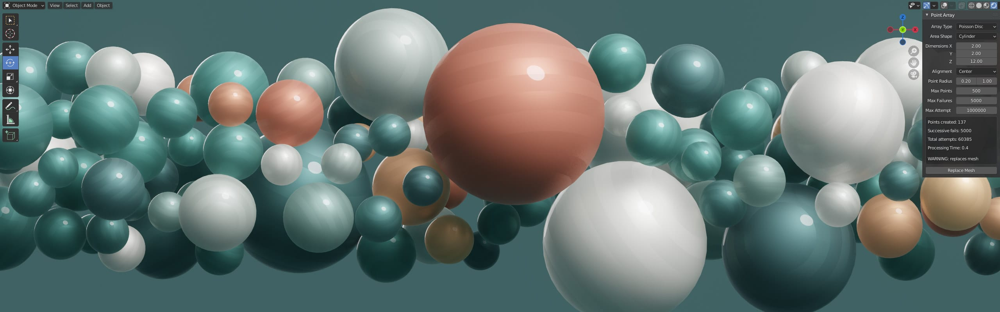

## Installation

- Download [VF_pointArray.py](https://raw.githubusercontent.com/jeinselen/VF-BlenderPointArray/main/VF_pointArray.py)
- Open Blender Preferences and navigate to the "Add-ons" tab
- Install and enable the add-on
- It will show up in the 3D view `VF Tools` tab
- Select the desired options and a mesh object to replace
	- Data import options can create new objects based on file name or replace an existing item

## Settings

### `Array Type` options:
- `Cubic Grid` creates a cubic array of points
	- Can be used to create Volume Field (.vf) files for Unity 3D particle effects when paired with Geometry Nodes and the [VF Delivery add-on](https://github.com/jeinselen/VF-BlenderDelivery#volume-fields)
- `Golden Angle` uses the golden angle to create a spiral array of points
- `Poisson Disc` generates random points within the specified volume while removing any that overlap
- `Position Import (CSV/NPY)` imports internal or external data sources in CSV or NPY format as sequential point positions
- `Volume Field (Unity 3D)` imports external .vf formated 3D textures as a point array with named attributes

  

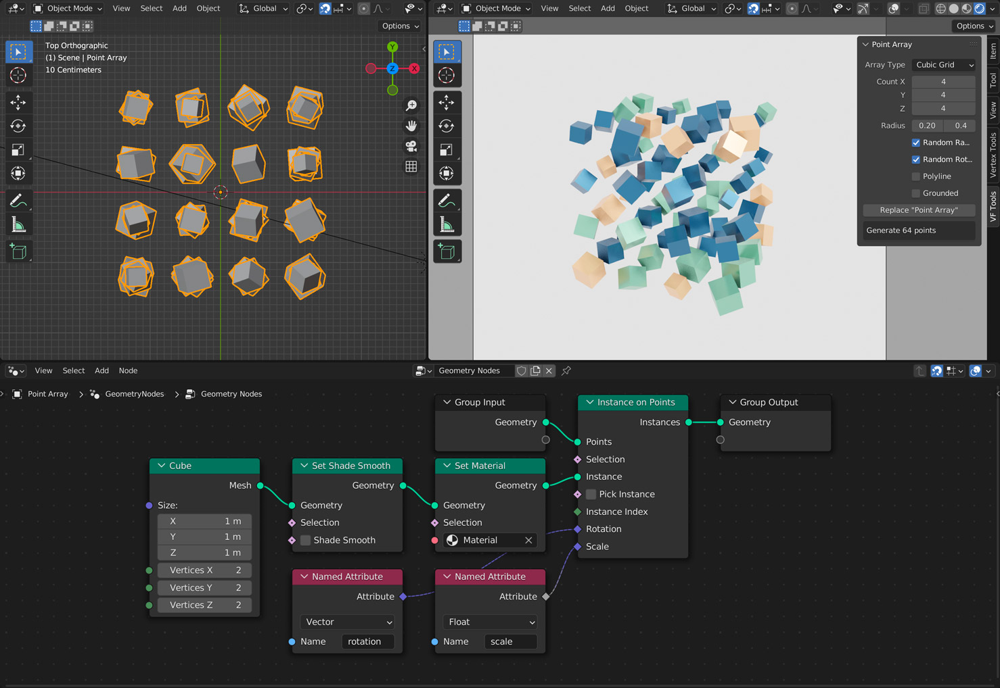

Download sample file: [settings1-cubic.blend.zip](images/settings1-cubic.blend.zip)

### `Cubic Grid` options:
- `Count` is the number of elements in each X, Y, Z dimension (the number of points that will be generated is displayed in the warning box)
- `Radius` controls both the `scale` named attribute and the total scale of the array
- `Random Radius` enables minimum and maximum radius inputs, with the maximum radius used for controlling the cubic grid size
- `Random Rotation` generates randomised values between -180° and +180° saved as radians in the `rotation` named attribute
- `Polyline` sequentially connects each vertex with a two-point polygon for conversion into curves or other use cases
- `Grounded` aligns the points so that the radius of the bottom points align with the ground (Z = 0)
- The `Replace "Name"` button dynamically updates to show which mesh will be replaced when clicked
- The number of points that will be generated using the current settings are displayed in the UI

Cubic grid generation is the first step when creating volume fields for Unity 3D particle animation effects. To learn more, please refer to the [VF Delivery documentation for creating and exporting volume fields.](https://github.com/jeinselen/VF-BlenderDelivery#volume-fields)

  

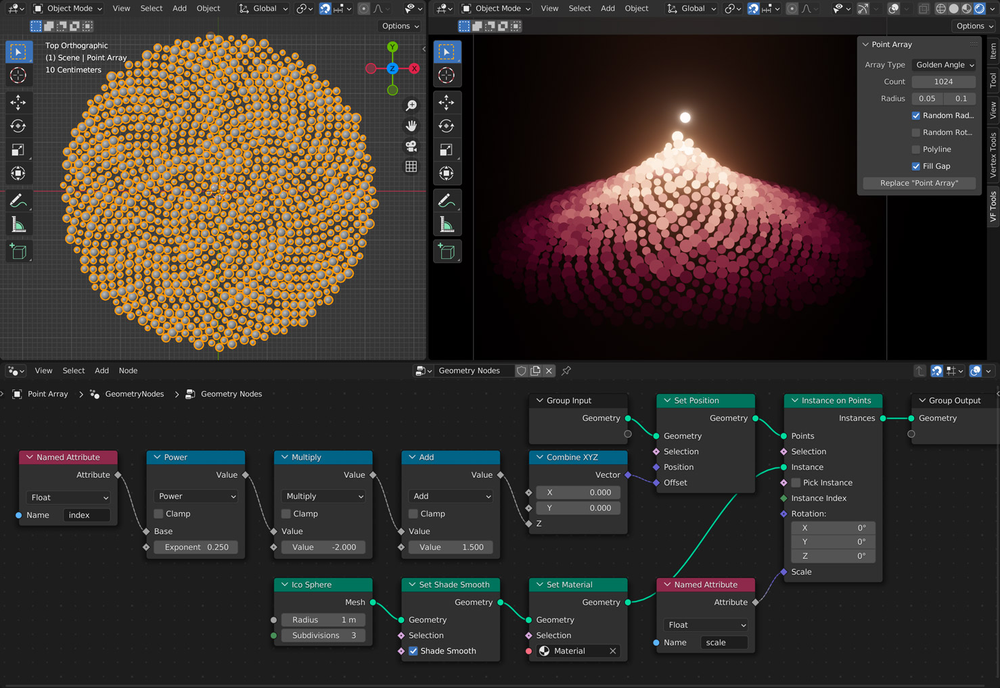

Download sample file: [settings2-golden.blend.zip](images/settings2-golden.blend.zip)

### `Golden Angle` options:
- `Count` defines the total number of elements to create
- `Radius` controls both the `scale` named attribute and the scale of the array based on spacing between each point
- `Random Radius` enables minimum and maximum radius inputs, with the maximum radius used for controlling the point spacing and array scale
- `Random Rotation` generates randomised values between -180° and +180° saved as radians in the `rotation` named attribute
- `Polyline` sequentially connects each vertex with a two-point polygon for conversion into curves or other use cases
- `Fill Gap` inserts an additional non-accurate point near the centre of the spiral to reduce the feeling of a gap in the mathematical array
- The `Replace "Name"` button dynamically updates to show which mesh will be replaced when clicked

  

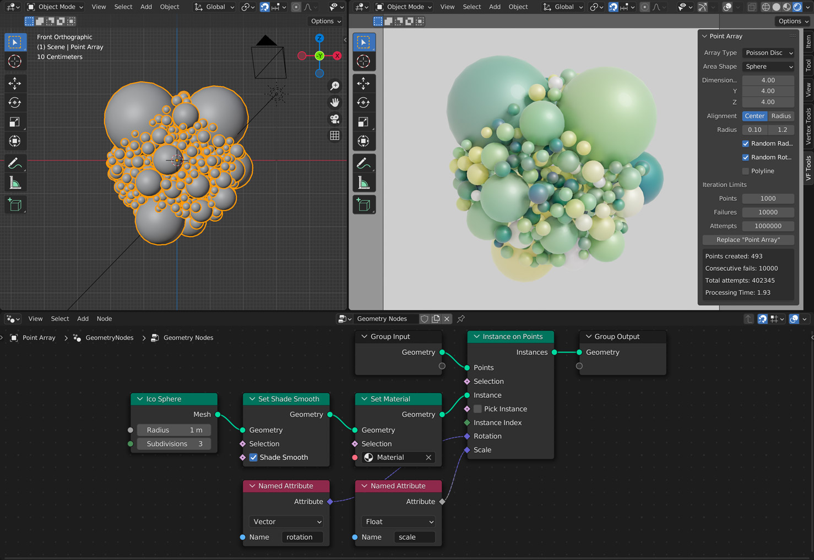

Download sample file: [settings3-poisson.blend.zip](images/settings3-poisson.blend.zip)

### `Poisson Disc` options:
Poisson sampling generates random points, testing each one to see if the point radius overlaps with any of the previously generated points. This can take a bit of time (without more advanced optimisation that's beyond the scope of this plugin), so options are provided for adjusting how many attempts should be made to find new random positions, helping cap the maximum amount of time spent searching for placement solutions.
- `Area Shape` selector:
	- `Box` is a simple cubic volume
	- `Cylinder` implements a radial cutoff aligned to the Z axis
	- `Sphere` implements a spherical cutoff
	- `Hull` scatters points on the surface of a sphere
- `Dimensions` controls the X, Y, Z scale of the chosen shape, allowing for volumes of any aspect ratio
- `Alignment` defines how the point radius interacts with the edge of the defined volume:
	- `Center` only checks the center point, and allows the radius to fall outside of the volume
	- `Radius` enforces strict volume containment, removing any points whose radius falls outside the volume
- `Radius` sets the point scale for poisson sample testing and the `scale` named attribute available in Geometry Nodes
- `Random Radius` enables minimum and maximum radius inputs to randomise the scale of each point
- `Random Rotation` generates randomised values between -180° and +180° saved as radians in the `rotation` named attribute
- `Polyline` sequentially connects each vertex with a two-point polygon for conversion into curves or other use cases
	- Because the points are generated randomly, the results are going to be...jumbled

#### Iteration Limits

- `Points` limits the total number of points generated
	- If this is very low points may be loosely scattered, if it's much higher, the add-on will typically hit maximum failures or attempts first
- `Failures` limits the total number of point placement failures that are allowed in a row
	- This helps optimise the algorithm, cutting off processing well before the maximum attempts limit is hit in cases where placement is extremely difficult (space is mostly full already)
- `Attempts` limits the total number of attempts, which should help prevent systems from freezing indefinitely

#### Generation and Feedback

- The `Replace "Name"` button dynamically updates to show which mesh will be replaced when clicked
- After at least one generative attempt, the number of points previously created, consecutive fails, total attempts, and processing time will displayed in the UI to help guide further tuning of the settings
	- If the total points created always reaches the maximum setting, the space isn't being efficiently filled and you can probably easily fit more points by raising the maximum failures and attempts
	- If the consecutive fails always reach the maximum setting, the settings are probably too stringent; either the maximum point radius is too large or the max failures is too low

It can take some work to tune the maximum points, failures, and attempts to get the performance and results you're looking for. The processing time is also displayed to help guide decisions.

  

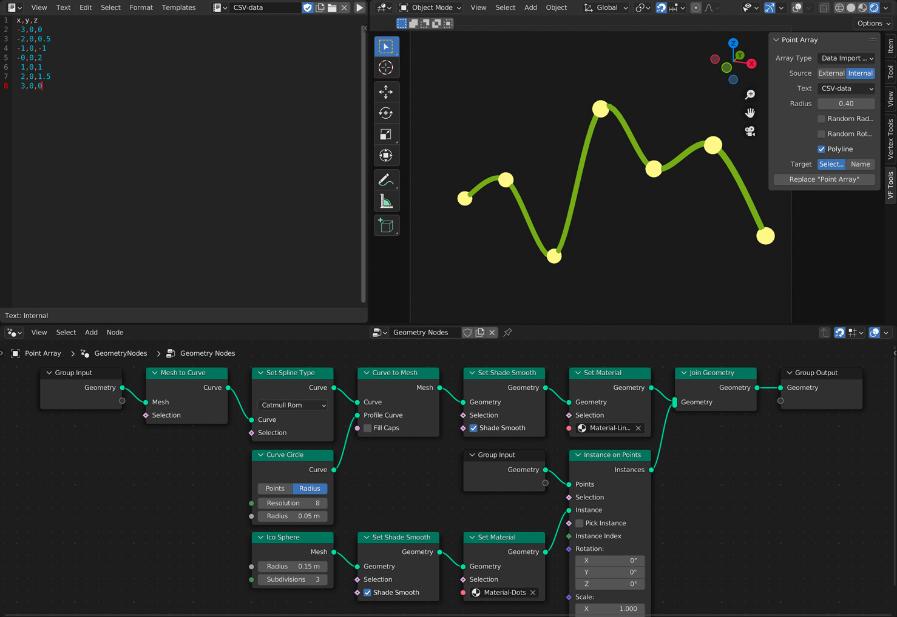

Download sample file: [settings4-data.blend.zip](images/settings4-data.blend.zip)

### `Data Import (CSV/NPY)` options:
- `Source` can be set to either `Internal` or `External`
	- `External` will load CSV or NPY format files from any absolute disk location
		- If this is selected, a `File` location input will appear, allowing you to choose any file that ends with `.csv` (comma separated values) or `.npy` (NumPy binary data format)
		- Relative paths are not supported, and must be disabled in the open file window settings
	- `Internal` will load CSV format plain text from data-blocks present in the Blender project; these can be internal text blocks or external files that have been loaded inside Blender
		- If this is selected, a `Text` drop down will appear, listing all available text data-blocks in the blender project
		- A `.py` extension must be used for Blender to recognise external text files as valid options
	- Warning: no formatting validation is performed until the create or replace button is pressed and the data import is attempted. Though some limited data cleansing is included, there is nothing preventing you from selecting a Python plugin loaded as a text data-block, or choosing a .docx file renamed to .csv. Choosing inputs with poorly formatted or missing data will likely crash the process

- `Radius` controls the `scale` named attribute but affects nothing else (no data scaling or point overlap check is performed)
- `Random Radius` enables minimum and maximum radius inputs for the `scale` named attribute
- `Random Rotation` generates randomised values between -180° and +180° saved as radians in the `rotation` named attribute
- `Polyline` sequentially connects each vertex with a two-point polygon for conversion into curves or other use cases
- `Target` switches between two creation or replacement approaches
	- `Selected` will replace the currently selected object (same behaviour as the other point array generators)
	- `Name` will create a new object or replace an existing one using the name of the data-block or input file
- The `Create "Name"` or `Replace "Name"` button dynamically updates to show which mesh will be created or replaced when clicked

 

 

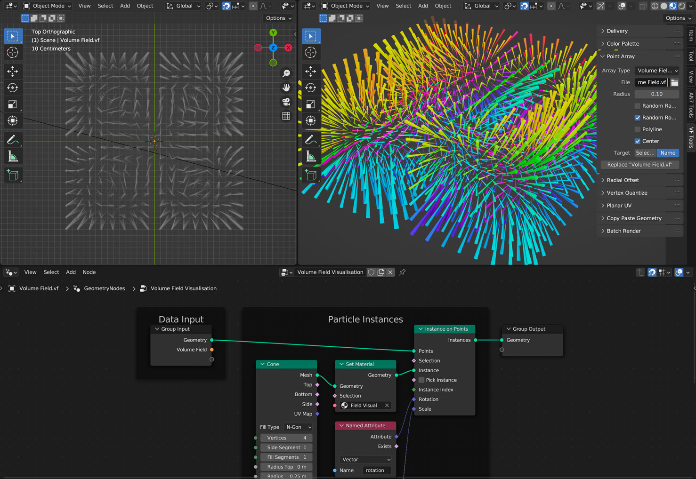

Download sample file: [settings5-volumefield.zip](images/settings5-volumefield.zip)

### `Volume Field (Unity 3D)` options:

The .vf (volume field) file format, a type of 3D texture used in Unity 3D, can include vector or float data. This plugin should import either type (storing imported data in `field_vector` or `field_float` attributes), but has only been tested with files containing vector data.

- `File` must point to an external file in binary .vf format
- `Radius` sets the spacing between points in the volumetric array and the `scale` named attribute
- `Random Radius` enables minimum and maximum radius inputs for the `scale` named attribute (the maximum scale will be used for spacing purposes)
- `Random Rotation` generates randomised values between -180° and +180° saved as radians in the `rotation` named attribute
	- This will be ignored when importing volume fields with vector data
- `Polyline` sequentially connects each vertex with a two-point polygon for conversion into curves or other use cases
- `Target` switches creation or replacement approaches
	- `Selected` will replace the currently selected object (same behaviour as the other point array generators)
	- `Name` will create a new object or replace an existing one using the name of the input file
- The `Create "Name"` or `Replace "Name"` button dynamically updates to show which mesh will be created or replaced when clicked

For instructions on how to build particle flow fields in Blender for use in Unity 3D, Unreal Engine, Godot, and other platforms, please refer to the [VF Delivery add-on documentation for creating and exporting volume fields.](https://github.com/jeinselen/VF-BlenderDelivery#volume-fields)

 

 

## Usage (Blender 3.3+)

It's easier than ever to work solely within Geometry Nodes in Blender 3.3+, but the Instance On Points node does not automatically reference named variables for scale and rotation, so they must be connected manually.

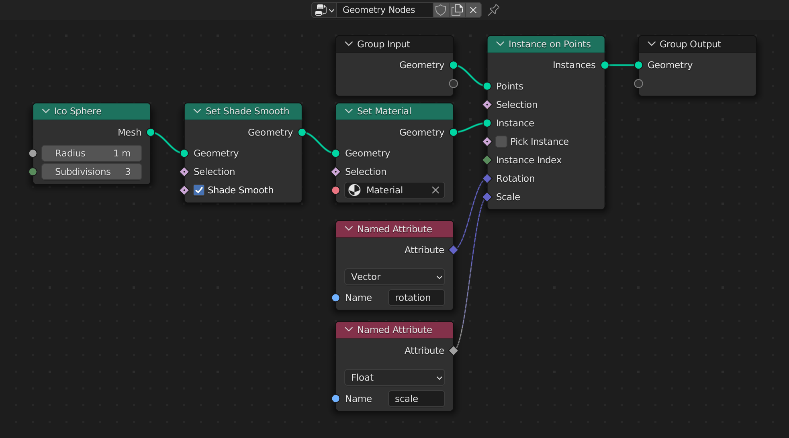

- Create an object to hold the generated point data
- Create a new Geometry Nodes system
	- Add an Instance on Points node
	- Add an object to be instanced with a 1m radius
		- This ensures the geometry being created is consistent with the values in the `scale` named attribute
	- User either Named Attribute nodes or input fields to reference the desired point data (rotation, scale, and others are available, depending on the type of array and the settings used)
- Generate new arrays to your hearts content

 

## Usage (Blender 2.93)

The generated data works pretty automatically in Blender 2.93, since the Point Instance node automatically references named variables for element scale and rotation.

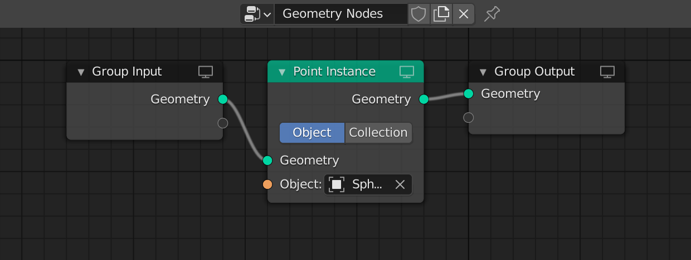

Check out the example files below for specific setups.

 

## Examples (Blender 2.93)

These demo files were created in Blender 2.93.x using named attribute nodes. The nodes in Blender 3.3.x may require setting up again, but the concepts are largely the same.

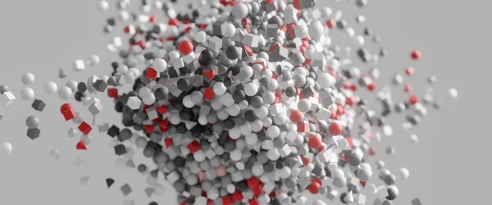

This example demonstrates use of the `point_distance` attribute, along with collection instancing.

[demo-cubic.blend.zip](images/demo-cubic.blend.zip)

 

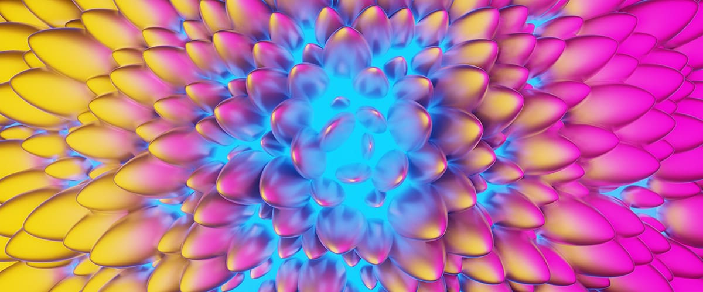

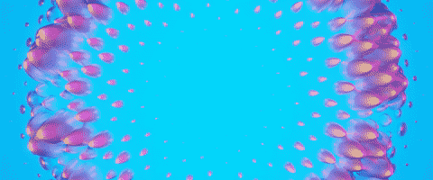

These files show a potential setup for rotating elements and animating them entirely in Geometry Nodes.

[demo-golden.blend.zip](images/demo-golden.blend.zip)

[demo-golden-animated.blend.zip](images/demo-golden-animated.blend.zip)

 

This project illustrates the use of multiple arrays and the center-aligned poisson-disc sampling in a spherical volume.

[demo-poisson.blend.zip](images/demo-poisson.blend.zip)
