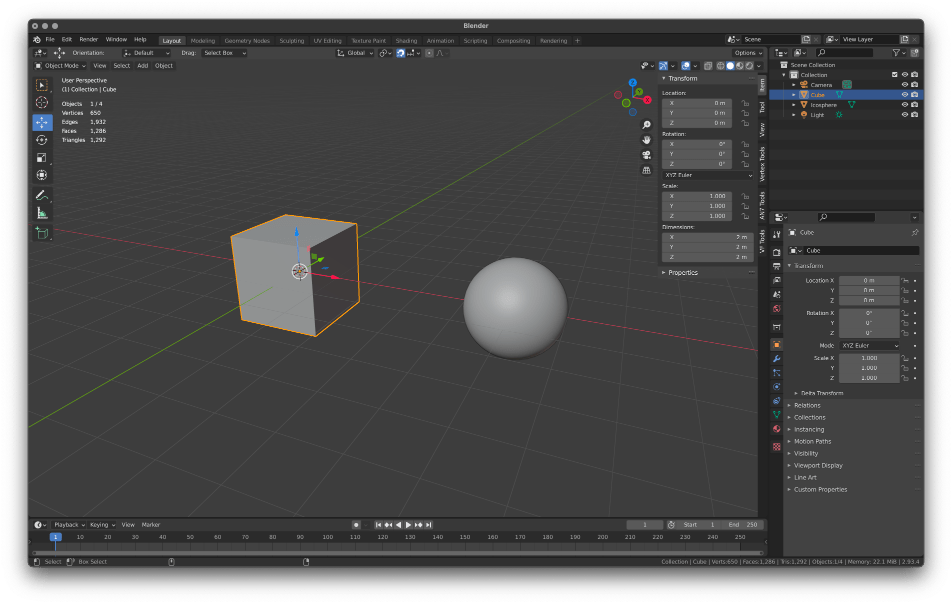
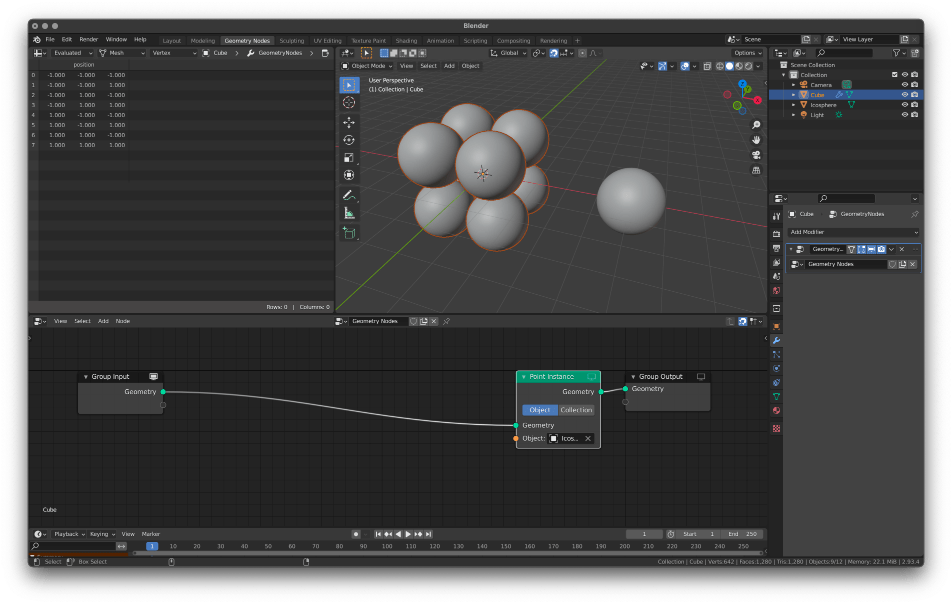
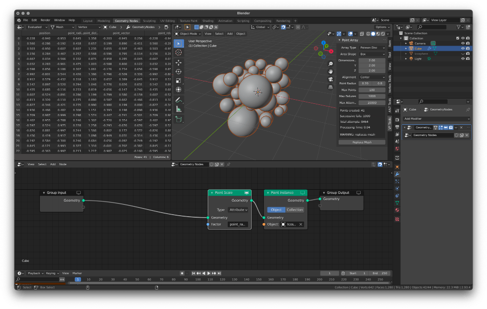
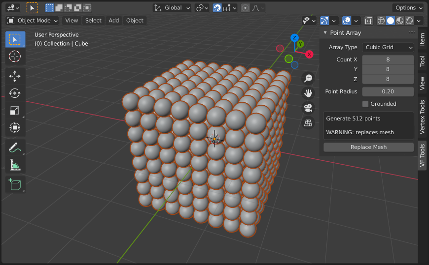
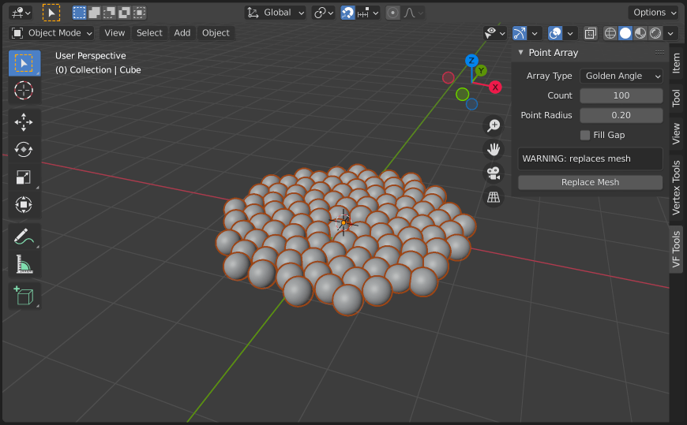
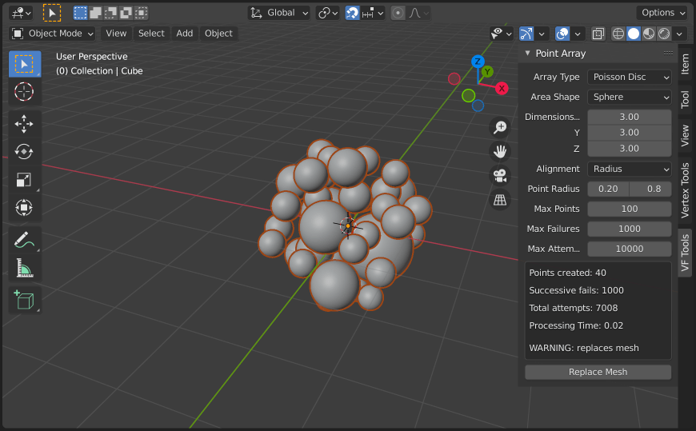

# VF Point Array

Create point arrays using cubic grid, golden angle, and poisson disc packing methods for use in Geometry Nodes.

## Installation

- Download the .py add-on file
- Install and enable the add-on using the Add-ons tab in Blender Preferences

## Usage

- Create two new objects; the array object and the instance object
	- The array object will be replaced by the add-on, so it doesn't really matter, but the instance object will work best if it's created with a radius of exactly 1m

- Create a new Geometry Nodes system on the array object and set up instancing
	- The add-on will create several attributes for use in Geometry Nodes, in particular the radius value for setting the object scale

- In object mode select the array object and click `Replace Mesh`
	- The mesh will be replaced with the new array for easy, but be careful; don't replace the wrong mesh (this add-on does register with the undo system, however, so it shouldn't cause any permanent damage!)

See the downloadable projects at the bottom of this page for specific examples of how this plugin can be used.

## Settings

- `Array Type` options:
	- `Cubic Grid` creates a cubic array of points
	- `Golden Angle` uses the golden angle to create a spiral array of points
	- `Poisson Disc` generates random points within the specified volume while removing any that overlap

 

### `Cubic Grid` options:
- `Count` is the number of elements in each X, Y, Z dimension (the number of points that will be generated is displayed in the warning box)
- `Point Radius` controls both the point_radius attribute available in Geometry Nodes and the spacing between each point in the array
- `Grounded` aligns the points above the ground so that the lowest point radius rests on the ground (Z = 0.0)

 

### `Golden Angle` options:
- `Count` is the total number of elements created
- `Point Radius` controls both the point_radius attribute available in Geometry Nodes and the spacing between each point in the array
- `Fill Gap` inserts an additional non-accurate point near the centre of the spiral to reduce the feeling of a gap in the mathematical array

 

### `Poisson Disc` options:
- `Area Shape` selector:
	- `Box` is a simple cubic volume
	- `Cylinder` implements a radial cutoff aligned to the Z axis
	- `Sphere` implements a spherical cutoff
	- `Hull` scatters points on the surface of a sphere
- `Dimensions` controls the X, Y, Z space of the chosen shape, allowing for heavily skewed volumes if needed
- `Alignment` defines how the point radius interacts with the edge of the defined volume:
	- `Center` only checks the center point, and allows the radius to fall outside of the volume
	- `Radius` enforces strict volume containment, removing any points whose radius falls outside the volume
- `Point Radius` sets the minimum and maximum limits of the random point radius (set these to the same value if you don't want random sizes)
- `Max Points` limits the total number of points generated
	- If this is very low points may be loosely scattered, if it's much higher, the add-on will typically hit maximum failures or attempts first
- `Max Failures` limits the total number of point placement failures that are allowed in a row
	- This helps optimise the algorithm, cutting off processing well before the maximum attempts limit is hit in cases where placement is extremely difficult (space is mostly full already)
- `Max Attempts` limits the total number of attempts, which should help prevent systems from freezing indefinitely

It can take some work to tune the maximum points, failures, and attempts to get the performance and results you're looking for. The warning box displays the previous process to help diagnose where the algorithm is hitting limits. For example, if the successive fails are always maxed out but points created and total attempts aren't remotely close to the limits, you could reduce the total number of attempts while increasing the allowed failures before regenerating. So long as the processing time (also displayed) is within a range you're comfortable with.

## Examples

All demo files created in Blender 2.93.x and make use of named attribute nodes no longer supported in Blender 3.3.x, but the concepts should remain largely the same; named attributes simply need to be associated with a group input instead of within the node tree.

This example demonstrates use of the `point_distance` attribute, along with collection instancing.

[demo-cubic.blend](images/demo-cubic.blend.zip)

 

These files show a potential setup for rotating elements and animating them entirely in Geometry Nodes.

[demo-golden.blend](images/demo-golden.blend.zip)

[demo-golden-animated.blend](images/demo-golden-animated.blend.zip)

 

This project illustrates the use of multiple arrays and the center-aligned poisson-disc sampling in a spherical volume.

[demo-poisson.blend](images/demo-poisson.blend.zip)
